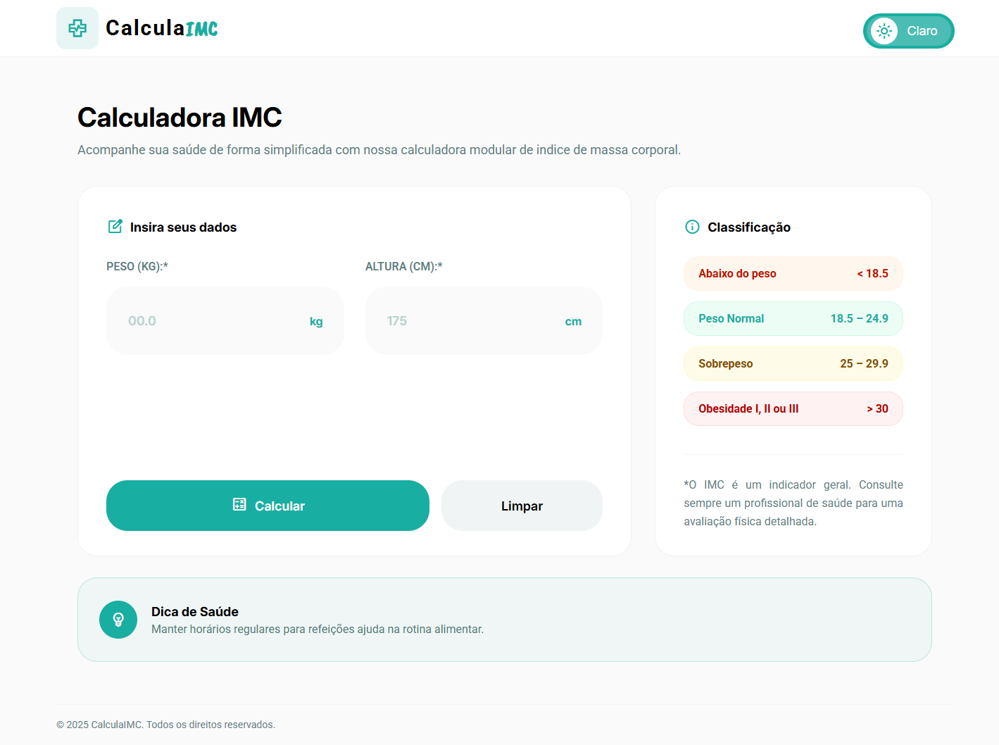
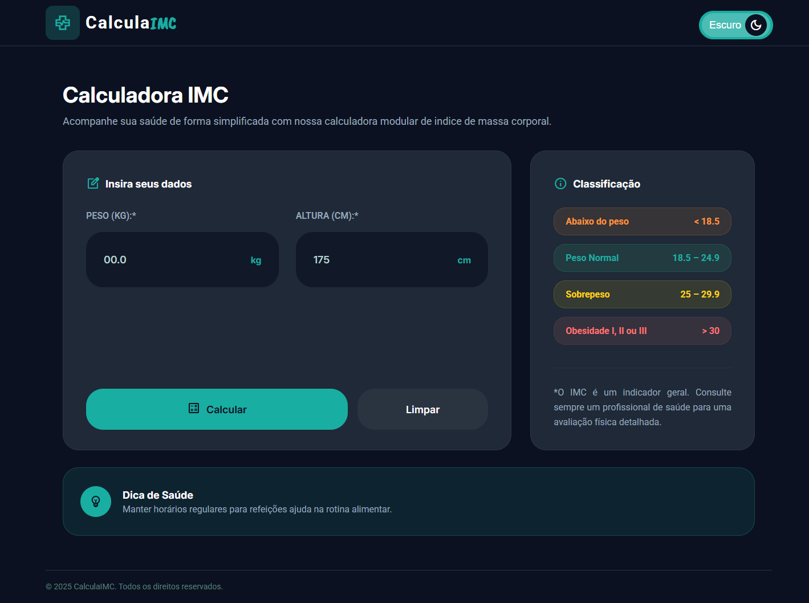

<h1 align="center">Calculadora IMC</h1>

<table align="center">
  <tr>
    <td align="left">
      
    </td>
    <td align="right">
      
    </td>
  </tr>
</table>
<p align="center">
  <a href="https://nathxrz.github.io/bmi-calculator/">🔗 Acessar protótipo</a>
</p>

<hr>

## 📋 Descrição do projeto

<i><strong>Calculadora de IMC</strong></i> é uma aplicação web interativa que permite aos usuários calcular seu Índice de Massa Corporal (IMC) de forma rápida e intuitiva. O projeto foi desenvolvido como prática de <i><strong>ReactJS</strong></i>, focando em boas práticas de desenvolvimento e organização de código.

- Projeto desenvolvido durante o <i><strong>estudo pessoal</strong></i>.
- Foco em <i><strong>boas práticas</strong></i> e <i><strong>aprendizado técnico</strong></i>.

## 🚀 Status do projeto

✅ Concluído

## ✨ Funcionalidades

- <i><strong>Cálculo de IMC:</strong></i> Insira peso (kg) e altura (cm) para calcular automaticamente o IMC.
- <i><strong>Classificação detalhada:</strong></i> Exibe a classificação do IMC em 8 categorias (desde baixo peso grave até obesidade mórbida).
- <i><strong>Dicas de saúde:</strong></i> Fornece recomendações personalizadas baseadas no resultado do IMC.
- <i><strong>Tema claro/escuro:</strong></i> Alternância entre temas para melhor experiência do usuário.
- <i><strong>Validação de formulário:</strong></i> Validação de entradas com feedback visual de erros.
- <i><strong>Tabela de classificação:</strong></i> Visualização completa das faixas de IMC e suas classificações.
- <i><strong>Interface responsiva:</strong></i> Design adaptável para diferentes tamanhos de tela (desktop).
- <i><strong>Feedback visual colorido:</strong></i> Código de cores para diferentes faixas de IMC.

## 🎨 Layout

O layout foi desenvolvido com o auxílio do <a href="https://stitch.withgoogle.com/">Stitch</a>, uma ferramenta de design de interfaces com IA do Google, e posteriormente refinado no <a href="https://www.figma.com/pt-br/design/">Figma</a>, plataforma baseada em nuvem para criação, prototipagem e colaboração em tempo real de interfaces (UI/UX).

## 🛠️ Tecnologias

As seguintes ferramentas foram usadas na construção do projeto:

- <i><strong>React 19.2.0:</strong></i> Biblioteca JavaScript para construção da interface.
- <i><strong>TypeScript 5.9.3:</strong></i> Superset do JavaScript para tipagem estática.
- <i><strong>Vite 7.2.4:</strong></i> Build tool moderna e rápida.
- <i><strong>CSS Modules:</strong></i> Escopamento de estilos por componente.
- <i><strong>Context API:</strong></i> Gerenciamento de estado global (tema).
- <i><strong>ESLint:</strong></i> Linting e padronização de código.
- <i><strong>GitHub Pages:</strong></i> Hospedagem da aplicação.

## 📚 Aprendizados

Durante o desenvolvimento deste projeto, foi possível praticar e aprender:

- <i><strong>Componentização e Props:</strong></i> Criação de componentes reutilizáveis com tipagem TypeScript, passando props de forma segura.
- <i><strong>React Hooks:</strong></i> Utilização de useState para gerenciamento de estado local e useContext para compartilhar estado global.
- <i><strong>Context API:</strong></i> Implementação de tema claro/escuro com ThemeModeContext sem prop drilling.
- <i><strong>CSS Modules:</strong></i> Organização de estilos com escopo por componente, evitando conflitos de classes.
- <i><strong>Validação de formulários:</strong></i> Tratamento de erros e feedback visual para melhor experiência do usuário.
- <i><strong>Manipulação de eventos:</strong></i> Tratamento de onChange, onClick e validação de inputs em tempo real.
- <i><strong>TypeScript com React:</strong></i> Tipagem de props, estados, eventos e funções para código mais seguro e manutenível.
- <i><strong>Estrutura de projeto:</strong></i> Organização modular de pastas (components, context, data) seguindo boas práticas.
- <i><strong>Cálculos matemáticos:</strong></i> Implementação de fórmula do IMC e lógica de classificação com ranges dinâmicos.
- <i><strong>Renderização condicional:</strong></i> Exibição de resultados e mensagens de erro baseados no estado da aplicação.

## 🔮 Próximos passos

- <i><strong>Responsividade aprimorada:</strong></i> Otimizar layout para dispositivos móveis menores.
- <i><strong>Animações:</strong></i> Transições suaves entre temas e ao exibir resultados (Framer Motion).
- <i><strong>Exportação de dados:</strong></i> Gerar PDF ou imagem com o resultado do IMC.
- <i><strong>Dark mode automático:</strong></i> Detectar preferência do sistema operacional do usuário.

## ⚙️ Como executar o projeto

```bash
# Clone este repositório
git clone https://github.com/nathxrz/bmi-calculator.git

# Acesse a pasta do projeto
cd .\bmi-calculator\

# Baixar dependências
npm install

# Executar projeto
npm run dev

```

## 📩 Contato

- 📧 nathyrezendemachado@gmail.com <br>
- 💼 <a href="https://www.linkedin.com/in/nathalia-machado-021b1b230/"> LinkedIn</a> <br>
